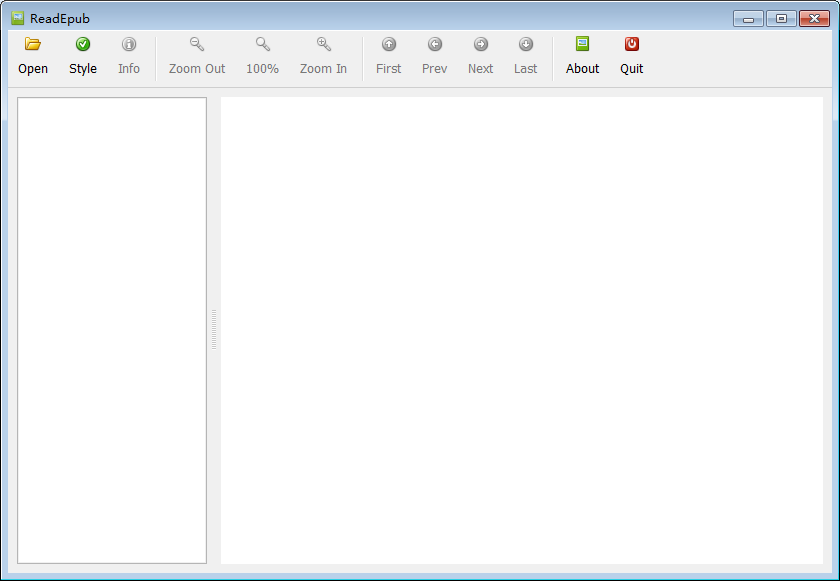
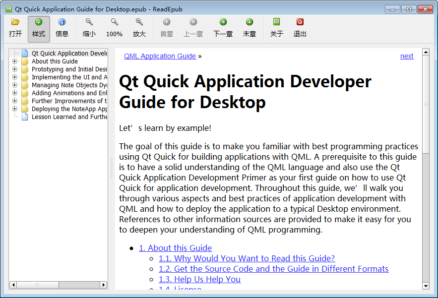

# ReadEpub #

A fast and simple EPUB reader written in C++/Qt.

Features:

- Lightweight, fast.
- Command line / Drag and drop support.
- TOC and linear navigation.
- Keep / ignore original styles.
- Book information. 
- Zoom in / out.
- Multilingual: EN, ZH-CN, ZH-TW.

